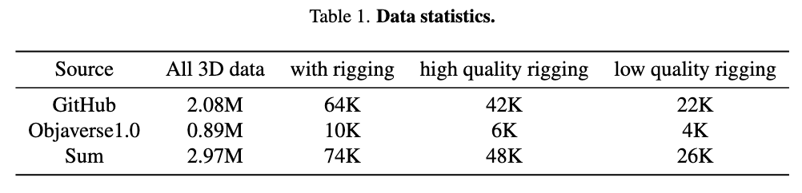
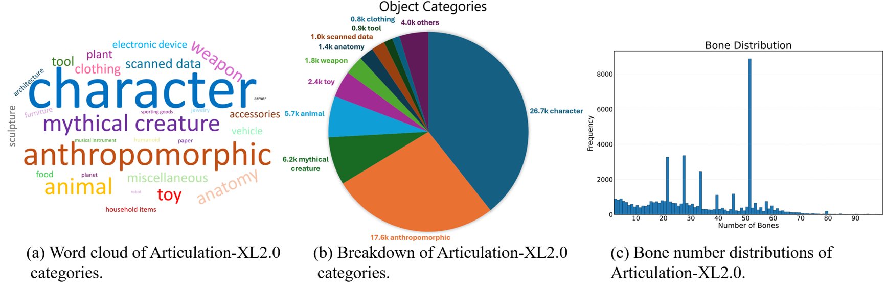
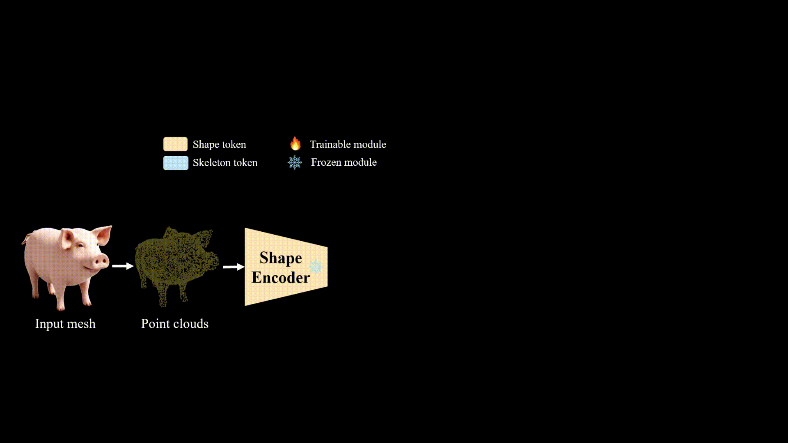
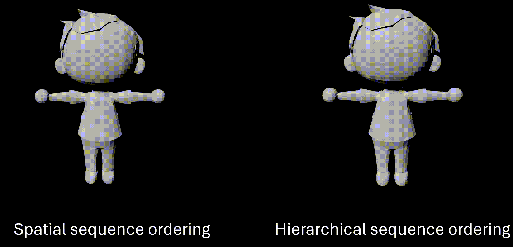

<div align="center">

<h1>MagicArticulate: Make Your 3D Models Articulation-Ready</h1>

<p>
  <a href="https://chaoyuesong.github.io"><strong>Chaoyue Song</strong></a><sup>1,2</sup>,
  <a href="https://jeff95.me/"><strong>Jianfeng Zhang</strong></a><sup>2*</sup>,
  <a href="https://lixiulive.com/"><strong>Xiu Li</strong></a><sup>2</sup>,
  <a href="https://scholar.google.com/citations?user=afDvaa8AAAAJ&hl"><strong>Fan Yang</strong></a><sup>1,2</sup>,
  <a href="https://buaacyw.github.io/"><strong>Yiwen Chen</strong></a><sup>1</sup>,
  <a href="https://zcxu-eric.github.io/"><strong>Zhongcong Xu</strong></a><sup>2</sup>,
 <br>
  <a href="https://liewjunhao.github.io/"><strong>Jun Hao Liew</strong></a><sup>2</sup>,
  <strong>Xiaoyang Guo</strong><sup>2</sup>,
  <a href="https://sites.google.com/site/fayaoliu"><strong>Fayao Liu</strong></a><sup>3</sup>,
  <a href="https://scholar.google.com.sg/citations?user=Q8iay0gAAAAJ"><strong>Jiashi Feng</strong></a><sup>2</sup>,
  <a href="https://guosheng.github.io/"><strong>Guosheng Lin</strong></a><sup>1*</sup>
  <br>
  *Corresponding authors
  <br>
    <sup>1 </sup>Nanyang Technological University
  <sup>2 </sup>Bytedance Seed
  <sup>3 </sup>A*STAR
</p>

<h3>arXiv 2025</h3>

<div align="center">
  
</div>

<p>
  <a href="https://chaoyuesong.github.io/MagicArticulate/"><strong>Project</strong></a> |
  <a href="https://chaoyuesong.github.io/files/MagicArticulate_paper.pdf"><strong>Paper</strong></a> |
  <a href="https://www.youtube.com/watch?v=eJP_VR4cVnk"><strong>Video</strong></a> |
  <a href="https://huggingface.co/datasets/chaoyue7/Articulation-XL2.0"><strong>Data: Articulation-XL2.0</strong></a>
</p>


</div>

<br />

## News
- 2025.2.16: Release [paper](https://chaoyuesong.github.io/files/MagicArticulate_paper.pdf), metadata for [Articulation-XL2.0](https://huggingface.co/datasets/chaoyue7/Articulation-XL2.0) and data visualization codes!

## Dataset: Articulation-XL2.0
### Overview
We introduces <b>Articulation-XL2.0</b>, a large-scale dataset featuring over <b>48K</b> 3D models with high-quality articulation annotations, filtered from Objaverse-XL. Compared to version 1.0, Articulation-XL2.0 includes 3D models with multiple components. For further details, please refer to the statistics below.
<p align="center">
  
</p>
Note: The data with rigging has been deduplicated (over 150K). The quality of most data has been manually verified.

<p align="center">
  
</p>

### Data visualization
We provide a method for visualizing 3D models with skeleton using [Pyrender](https://github.com/mmatl/pyrender), modified from [Lab4D](https://github.com/lab4d-org/lab4d/tree/ppr/). For more details, please refer [here](https://github.com/Seed3D/MagicArticulate/tree/main/data_visualization).

## Autoregressive skeleton generation

### Overview
We formulate skeleton generation as a sequence modeling problem, leveraging an autoregressive transformer to naturally handle varying numbers of bones or joints within skeletons.
<p align="center">
  
</p>

### Sequence ordering
We provide two ways for sequence ordering: spatial and hierarchical sequence ordering. More details please refer to the paper.
<p align="center">
  
</p>

## Acknowledgment

We appreciate the insightful discussions with [Zhan Xu](https://github.com/zhan-xu) regrading [RigNet](https://github.com/zhan-xu/RigNet) and with [Biao Zhang](http://1zb.github.io/) regrading [Functional Diffusion](https://1zb.github.io/functional-diffusion/). The code is built based on [MeshAnything](https://github.com/buaacyw/MeshAnything), [Functional Diffusion](https://1zb.github.io/functional-diffusion/), [RigNet](https://github.com/zhan-xu/RigNet), [Michelangelo](https://github.com/NeuralCarver/Michelangelo/) and [Lab4D](https://github.com/lab4d-org/lab4d).


## Citation

```
@inproceedings{
}
```