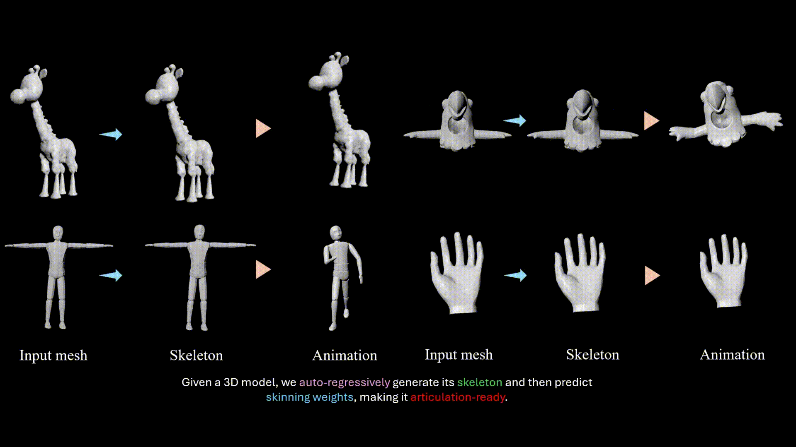

<div align="center">

<h1>MagicArticulate: Make Your 3D Models Articulation-Ready</h1>

<p>
  <a href="https://chaoyuesong.github.io"><strong>Chaoyue Song</strong></a><sup>1,2</sup>,
  <a href="http://jeff95.me/"><strong>Jianfeng Zhang</strong></a><sup>2*</sup>,
  <a href="https://lixiulive.com/"><strong>Xiu Li</strong></a><sup>2</sup>,
  <a href="https://scholar.google.com/citations?user=afDvaa8AAAAJ&hl"><strong>Fan Yang</strong></a><sup>1</sup>,
  <a href="https://buaacyw.github.io/"><strong>Yiwen Chen</strong></a><sup>1</sup>,
  <a href="https://zcxu-eric.github.io/"><strong>Zhongcong Xu</strong></a><sup>2</sup>,
 <br>
  <a href="https://liewjunhao.github.io/"><strong>Jun Hao Liew</strong></a><sup>2</sup>,
  <strong>Xiaoyang Guo</strong><sup>2</sup>,
  <a href="https://sites.google.com/site/fayaoliu"><strong>Fayao Liu</strong></a><sup>3</sup>,
  <a href="https://scholar.google.com.sg/citations?user=Q8iay0gAAAAJ"><strong>Jiashi Feng</strong></a><sup>2</sup>,
  <a href="https://guosheng.github.io/"><strong>Guosheng Lin</strong></a><sup>1*</sup>
  <br>
  *Corresponding authors
  <br>
    <sup>1 </sup>Nanyang Technological University
  <sup>2 </sup>Bytedance Seed
  <sup>3 </sup>A*STAR
</p>

<h3>CVPR 2025</h3>

<div align="center">
  
</div>

<p>
  <a href="https://chaoyuesong.github.io/MagicArticulate/"><strong>Project</strong></a> |
  <a href="https://arxiv.org/abs/2502.12135"><strong>Paper</strong></a> |
  <a href="https://www.youtube.com/watch?v=eJP_VR4cVnk"><strong>Video</strong></a> |
  <a href="https://huggingface.co/datasets/chaoyue7/Articulation-XL2.0"><strong>Data: Articulation-XL2.0</strong></a>
</p>


</div>

<br />

## News
- 2025.4.18: We have updated the preprocessed dataset to exclude entries with skinning issues (118 from the training and 3 from the test, whose skinning weight row sums fell below 1) and duplicated joint names (2 from the training). You can download the [cleaned data](https://huggingface.co/datasets/chaoyue7/Articulation-XL2.0) again or update it yourself by running: `python data_utils/update_npz_rm_issue_data.py`. Still remember to normalize skinning weights in your dataloader.
- 2025.4.16: Release [weights](https://huggingface.co/Seed3D/MagicArticulate) for skeleton generation.
- 2025.3.28: Release inference codes for skeleton generation.
- 2025.3.20: Release preprocessed data of [Articulation-XL2.0](https://huggingface.co/datasets/chaoyue7/Articulation-XL2.0) (add vertex normals), we split it into training (46.7k) and testing set (2k). Try it now!!!
- 2025.2.27: MagicArticulate was accepted by CVPR2025, see you in Nashville! Data and code are coming soon—stay tuned! 🚀
- 2025.2.16: Release [paper](https://arxiv.org/abs/2502.12135), metadata for [Articulation-XL2.0](https://huggingface.co/datasets/chaoyue7/Articulation-XL2.0) and data visualization codes!

## Dataset: Articulation-XL2.0
### Overview
We introduce <b>Articulation-XL2.0</b>, a large-scale dataset featuring over <b>48K</b> 3D models with high-quality articulation annotations, filtered from Objaverse-XL. Compared to version 1.0, Articulation-XL2.0 includes 3D models with multiple components. For further details, please refer to the statistics below.
<p align="center">
  
</p>
Note: The data with rigging has been deduplicated (over 150K). The quality of most data has been manually verified.

<p align="center">
  
</p>

### Metadata
We provide the following information in the metadata of Articulation-XL2.0.
```
uuid,source,vertex_count,face_count,joint_count,bone_count,category_label,fileType,fileIdentifier
```

### Preprocessed data
We provide the preprocessed data that saved in NPZ files, which contain the following information:
```
'vertices', 'faces', 'normals', 'joints', 'bones', 'root_index', 'uuid', 'pc_w_norm', 'joint_names', 'skinning_weights_value', 'skinning_weights_row', 'skinning_weights_col', 'skinning_weights_shape'
```
Check [here](https://github.com/Seed3D/MagicArticulate/tree/main/data_utils) to see how to read and how we save it.

### Data visualization
We provide a method for visualizing 3D models with skeleton using [Pyrender](https://github.com/mmatl/pyrender), modified from [Lab4D](https://github.com/lab4d-org/lab4d/tree/ppr/). For more details, please refer [here](https://github.com/Seed3D/MagicArticulate/tree/main/data_utils).

## Autoregressive skeleton generation

### Overview
We formulate skeleton generation as a sequence modeling problem, leveraging an autoregressive transformer to naturally handle varying numbers of bones or joints within skeletons. If you are interested in autoregressive in GenAI, check [this awesome list](https://github.com/ChaoyueSong/Awesome-Auto-Regressive-in-GenerativeAI).
<p align="center">
  
</p>

### Sequence ordering
We provide two ways for sequence ordering: spatial and hierarchical sequence ordering. More details please refer to the paper.
<p align="center">
  
</p>

### Installtation
```
git clone https://github.com/Seed3D/MagicArticulate.git --recursive && cd MagicArticulate
conda create -n magicarti python==3.10.13 -y
conda activate magicarti
pip install torch==2.1.1 torchvision==0.16.1 torchaudio==2.1.1 --index-url https://download.pytorch.org/whl/cu118
pip install -r requirements.txt
pip install flash-attn==2.6.3 --no-build-isolation
```
Then download [checkpoints of Michelangelo](https://huggingface.co/Maikou/Michelangelo/tree/main/checkpoints/aligned_shape_latents) and our [released weights](https://huggingface.co/Seed3D/MagicArticulate) for skeleton generation:

```
python download.py
```

### Evaluation

You can run the following command for evaluating our models on `Articulation-XL2.0-test` and `ModelResource-test` from [RigNet](https://github.com/zhan-xu/RigNet). For your convenience, we also save ModelResource-test in our format (download it [here](https://www.dropbox.com/scl/fi/iv6jjka3s2j91i3l2fxt9/modelsresource_test.npz?rlkey=ptk49kz7e163xl50sh5kdm3wv&st=ago6ifsc&dl=0)). The inference process requires 4.6 GB of VRAM and takes 1–2 seconds per inference.

```
bash eval.sh
```
You can change `save_name` for different evaluation and check the quantitative results afterwards in `evaluate_results.txt`.

These are the numbers (the metrics are in units of 10−2) that you should be able to reproduce using the released weights and the current version of the codebase:
<table>
  <thead>
    <tr>
      <th rowspan="2">Test set</th>
      <th colspan="3">Articulation-XL2.0-test</th>
      <th colspan="3">ModelResource-test</th>
    </tr>
    <tr>
      <th>CD-J2J</th>
      <th>CD-J2B</th>
      <th>CD-B2B</th>
      <th>CD-J2J</th>
      <th>CD-J2B</th>
      <th>CD-B2B</th>
    </tr>
  </thead>
  <tbody>
    <tr>
      <td>Paper (train on 1.0, spatial)</td>
      <td>-</td>
      <td>-</td>
      <td>-</td>
      <td>4.103</td>
      <td>3.101</td>
      <td>2.672</td>
    </tr>
    <tr>
      <td>Paper (train on 1.0, hier)</td>
      <td>-</td>
      <td>-</td>
      <td>-</td>
      <td>4.451</td>
      <td>3.454</td>
      <td>2.998</td>
    </tr>
    <tr>
      <td>train on Arti-XL2.0 (spatial)</td>
	  <td><b>3.043</b></td>
      <td><b>2.293</b></td>
      <td><b>1.953</b></td>
      <td><b>3.936</b></td>
      <td><b>2.979</b></td>
      <td><b>2.588</b></td>
    </tr>
    <tr>
      <td>train on Arti-XL2.0 (hier)</td>
      <td>3.417</td>
      <td>2.692</td>
      <td>2.281</td>
      <td>4.116</td>
      <td>3.124</td>
      <td>2.704</td>
    </tr>
  </tbody>
</table>
The performance comparison between models trained on Articulation-XL1.0 versus 2.0 demonstrates the importance of dataset scaling with high quality. If you wish to compare your methods with MagicArticulate trained on Articulation-XL2.0, you may reference these results as a baseline for comparison.

### Demo
We provide some examples to test our models by running the following command. You can also test our models on your 3D objects, remeber to change the `input_dir`.
```
bash demo.sh
```

## Acknowledgment

We appreciate the insightful discussions with [Zhan Xu](https://github.com/zhan-xu) regrading [RigNet](https://github.com/zhan-xu/RigNet) and with [Biao Zhang](http://1zb.github.io/) regrading [Functional Diffusion](https://1zb.github.io/functional-diffusion/). The code is built based on [MeshAnything](https://github.com/buaacyw/MeshAnything), [Functional Diffusion](https://1zb.github.io/functional-diffusion/), [RigNet](https://github.com/zhan-xu/RigNet), [Michelangelo](https://github.com/NeuralCarver/Michelangelo/) and [Lab4D](https://github.com/lab4d-org/lab4d).


## Citation

```
@InProceedings{Song_2025_CVPR,
    author    = {Song, Chaoyue and Zhang, Jianfeng and Li, Xiu and Yang, Fan and Chen, Yiwen and Xu, Zhongcong and Liew, Jun Hao and Guo, Xiaoyang and Liu, Fayao and Feng, Jiashi and Lin, Guosheng},
    title     = {MagicArticulate: Make Your 3D Models Articulation-Ready},
    booktitle = {Proceedings of the Computer Vision and Pattern Recognition Conference (CVPR)},
    month     = {June},
    year      = {2025},
    pages     = {15998-16007}
}
```
