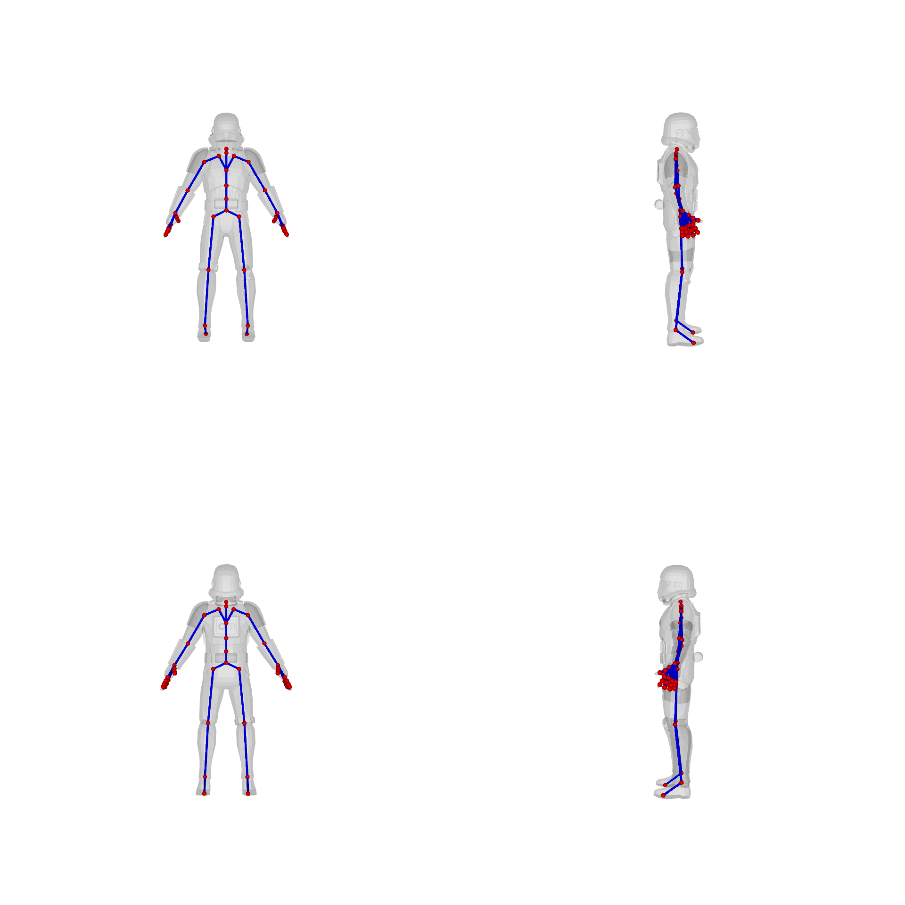

## Overview
We provide a method for visualizing 3D models with skeleton using [Pyrender](https://github.com/mmatl/pyrender), modified from [Lab4D](https://github.com/lab4d-org/lab4d/tree/ppr/). This visualization also serves as input to the VLM for skeleton quality rating.

## Installation
```
pip install trimesh opencv-python pyrender
```
## Visualization
We provide an example to demonstrate the process. For this example, we prepare an OBJ file along with a TXT file containing rigging information. Then, run:
```
python render_data.py
```
You will obtain the following outputs:

<p align="center">
  
</p>

